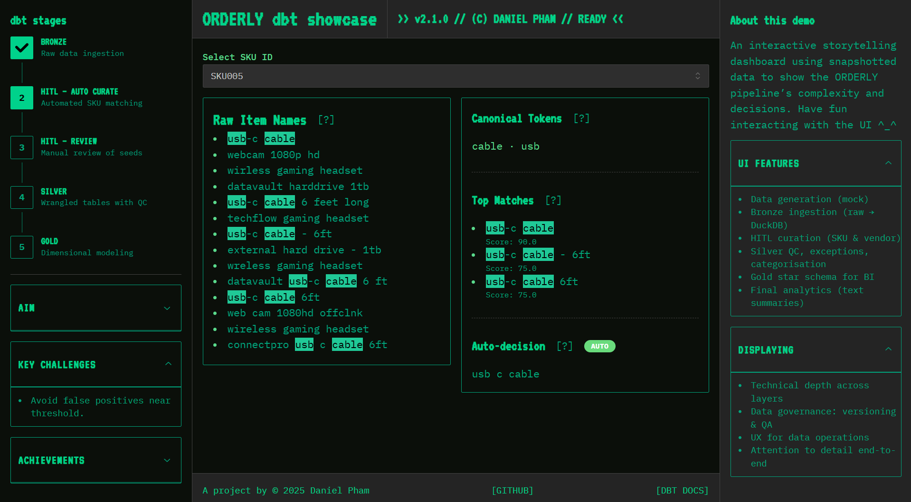
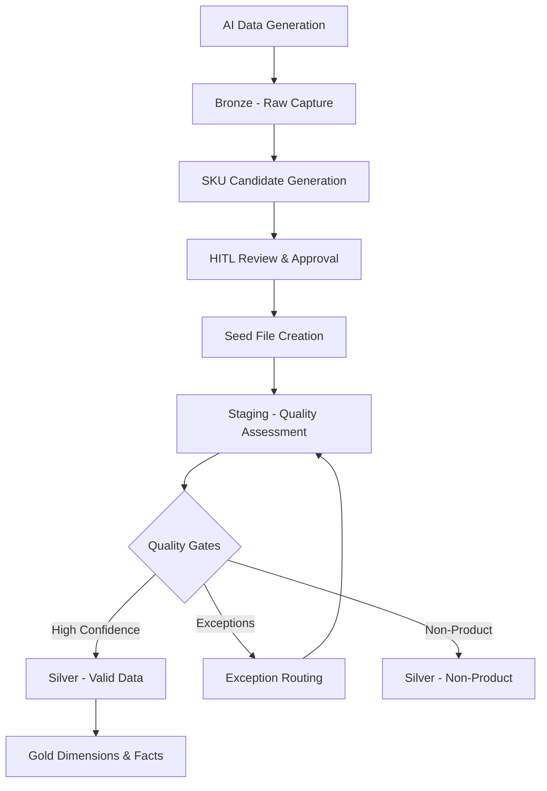

# 🧾 Orderly - Enterprise PO Line Item ETL Pipeline



[👉 Live Demo](https://orderly.danielpham.com.au)

_⚠️ All data is synthetic. No real or proprietary data is used._

## **Overview**

Orderly aims to solve an extremely challenging enterprise data engineering problem: convert chaotic, manually entered purchase order entries into gold-standard, analytics-ready procurement databases with complete auditability and business alignment, without relying on an existing master product catalog.

It addresses:
- Unstructured, erroneous item descriptions
- Vendor alias resolution at scale
- Missing product catalogs
- Multi-currency processing with historical gaps
- The operational need for **human-in-the-loop (HITL)** quality control

***

## **Notable Engineering Patterns**

- Confidence-based data validation and routing
- Fully auditable medallion architecture
- Exception-driven QA workflows
- Configurable quality thresholds
- Incremental reprocessing for scale
- Integration of HITL into automated pipelines without blocking throughput

***

## **Architecture Highlights**

**Design Principles**
- **Medallion Architecture** (Bronze / Silver / Gold) with strict separation of concerns and full data lineage
- **HITL integration** for SKU curation where automation alone is insufficient
- **Confidence-scored Data Quality** with graded exception routing instead of binary pass/fail
- **Incremental processing** for scale efficiency
- **Temporal FX rate interpolation** with auditability

**Key Technical Features**
- Immutable Bronze layer for raw capture and audit
- Explicit staging layer for quality scoring before promotion
- Tri-modal classification: valid, exception, non-product
- Gold layer designed as star schema for OLAP performance
- Exception workflows as first-class citizens—quality issues don’t break pipelines

***

## **Solved Data Challenges**

| Challenge | Solution |
|-----------|----------|
| No master SKU catalog | Canonical taxonomy built from AI-assisted clustering + human approval |
| Vendor name variations | Multi-stage fuzzy matching with confidence thresholds & manual overrides |
| Free-text descriptions | Token-based similarity scoring with domain-specific normalization rules |
| FX rate gaps | Linear interpolation with source attribution and confidence flags |
| Quality at scale | Exception-driven routing to human review without blocking good data |

***

## **Technology Stack**

**Core Pipeline**
- **Python** + **Pandas** - ETL logic, chunked processing for large datasets
- **DuckDB** - High-performance embedded OLAP store
- **dbt** - SQL transformation, testing, and documentation

**Data Quality & Matching**
- **RapidFuzz** - Token-based similarity scoring
- **pytest** - Automated ETL pipeline and contract tests

**HITL Workflow**
- **PydanticAI + LLMs** - AI-simulated synthetic PO data
- Interactive curation tools in **Jupyter** and CLI
- Version-controlled CSV seed files for mappings

***

## **Pipeline Flow**



***

## **Layer Breakdown**

**🥉 Bronze - Raw Ingestion**
- Immutable storage of source PO lines, vendor lists, cost centres, FX rates
- Preserves all errors and irregularities for reprocessing and compliance

**🔄 Staging - Quality Assessment**
- Applies data cleaning, fuzzy scoring, and multi-criteria quality flags
- Allows graded promotion decisions based on confidence

**🥈 Silver - Validated**
- Split into:
  - `silver_orders_valid` (≥80% confidence)
  - `silver_orders_exceptions` (requires manual intervention)
  - `silver_orders_nonproduct` (services, fees, etc.)

**💎 Gold - Analytics Models**
- Star schema with dimensions for product, vendor, cost centre, and date
- Facts:
  - `fct_order_line` with FX normalization
  - `fct_data_quality` for monitoring exception patterns
  - `fct_price_variance` for anomaly detection

***

## **HITL Strategy for SKU Resolution**

Automated matching handles volume; HITL ensures correctness where ambiguity remains:

1. **AI clustering** of free-text descriptions
2. **Fuzzy candidate generation**
3. **Human validation** via interactive tools
4. Approved mappings promoted to canonical SKU seed files
5. Pipeline reprocesses with updated mappings incrementally

***

## **Project Structure**

```
orderly/
├── demo_pipeline_local.py     # End-to-end orchestration
├── data/                      # Bronze / Silver / Gold outputs
├── data_generation/           # Synthetic data simulation
├── hitl/                      # SKU curation tools
├── dbt/                       # Models, seeds, macros, tests
├── notebooks/                 # Interactive exploration
└── tests/                     # Python unit tests
```

***

## **Run Locally**

```bash
# Setup
pip install -r requirements.txt

# Execute pipeline
python demo_pipeline_local.py
```